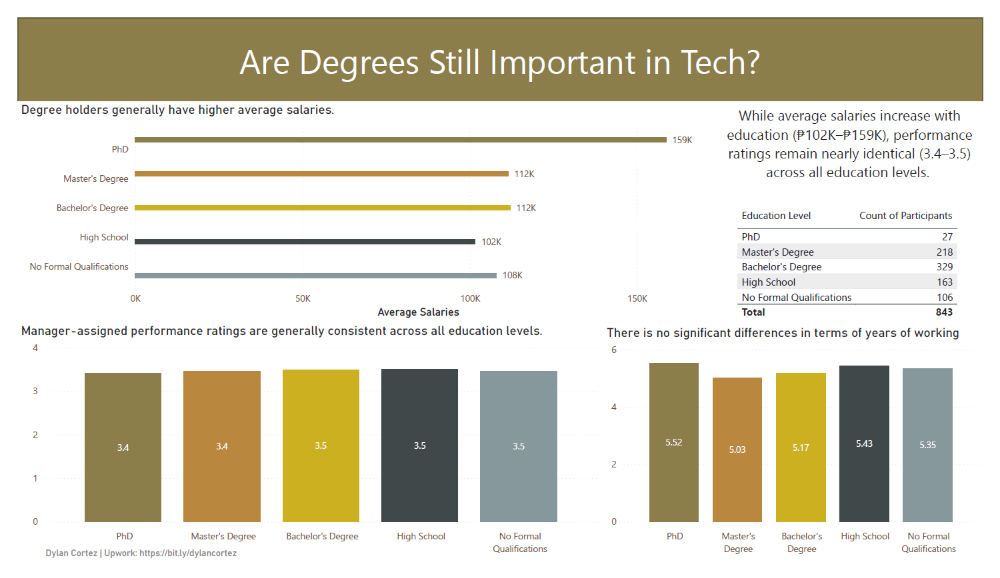
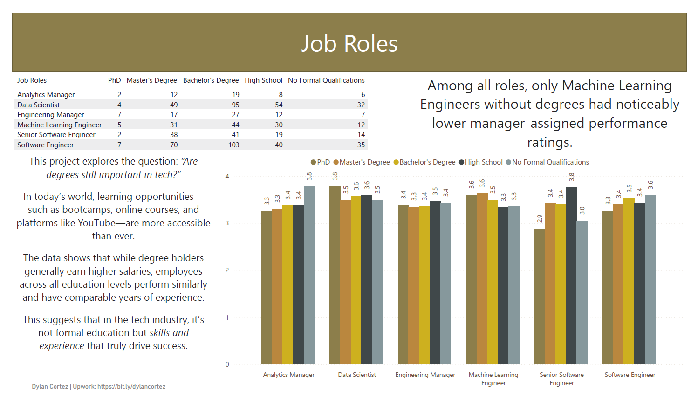

# Are Degrees Still Important in Tech?

This repository contains the code and data analysis for the project **"Are Degrees Still Important in Tech?"**

## 📌 Overview

This project explores the question: “Are degrees still important in tech?”
In today’s world, learning opportunities—such as bootcamps, online courses, and platforms like YouTube—are more accessible than ever.

The analysis includes:
- Data cleaning and preprocessing
- Exploratory data analysis (EDA)
- Visualizations

## 🧠 Objectives

Answer these questions:

1. Do degree holders earn higher average salaries?
2. Do they tend to stay longer (better tenure)?
3. Do they outperform non-degree holders in performance metrics?

## 📊 Power BI Dashboard

The Power BI dashboard provides an interactive view of the relationship between education level, employee performance, and attrition.

### 🔍 Preview

You can download and open the `.pbix` file in Power BI Desktop to explore the dashboard in full:
[Download Dashboard](Project_Are_degrees_still_important_in_tech.pbix)

## 📊 Data Source:
This project uses data from the following Kaggle dataset:  
[HR Analytics: Employee Attrition and Performance]
(https://www.kaggle.com/datasets/mahmoudemadabdallah/hr-analytics-employee-attrition-and-performance)

## 🙋‍♂️ Contributions
Contributions, issues, and feature requests are welcome!
If you have access to relevant datasets or would like to expand the scope, feel free to open a pull request.

## ✉️ Contact
For questions, feedback, or collaboration:

**Dylan Cortez**
📧 cortezdylan2135@gmail.com
